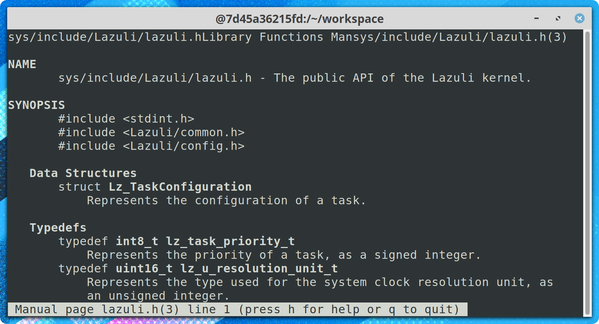
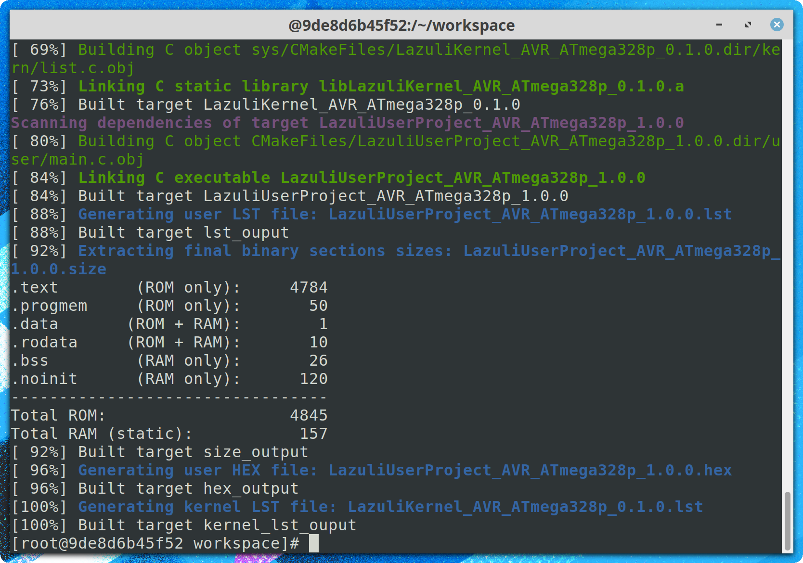

<!---
SPDX-License-Identifier: GPL-3.0-only
This file is part of Lazuli.
Copyright (c) 2017-2020, Remi Andruccioli <remi.andruccioli@gmail.com>
--->

# Lazuli RTOS

## What is Lazuli ?

Lazuli is a preemptive multitasking RTOS (Real-Time Operating System/kernel),
targeting AVR microcontrollers.
It allows to program and run multiple independent tasks in a real-time context
on AVR microcontrollers.
In its basic configuration, Lazuli RTOS has a low memory footprint (< 4
kilobytes of ROM, < 200 bytes of static RAM).
Lazuli RTOS can be used to develop embedded applications or firmwares that have
strong real-time constraints or demand multitasking, on minimal hardware.

AVR MCUs are widely used in embedded, industrial devices and applications, and
are also known to be used on Arduino boards.
Applications written on top of Lazuli RTOS suit industrial systems as well as
hobbyists creations.

Lazuli RTOS is distributed in its source code form, to be built and statically
linked with your own final executable.
This allows the kernel to be statically configured, and benefit from compiler
optimizations.

The project is hosted on GitHub at https://github.com/randruc/Lazuli

### Features

* Preemptive multitasking of user tasks
* Real-time scheduling
* No MMU required
* "ROMable": all the system can fit in ROM
* Highly configurable, with a modular architecture
* A "wait for event" programming model
* A complete and containerized development environment
* A complete documentation: API documentation, user and kernel documentation

### Functionalities

For now, the Lazuli kernel provides the following functionalities:

* Rate Monotonic Scheduling
* Priority Round-Robin Scheduling (POSIX's `SCHED_RR`)
* Mutexes
* AVR USART driver, including a complete `printf()` implementation.

### Challenge and philosophy

The Lazuli project has very specific goals that make it unique. These are:

* __Free software__ - This project is developed with and can be built using only
  free software.
* __Pure ANSI C (89)__ - Lazuli is coded in pure C89 for all of its C parts.
  It means that no compiler-specific code nor extensions to the C language are
  used. This choice has been made the allow to code to be ported easily (if
  needed in the future) to many platforms and architectures, and to be compiled
  by the largest number of compilers. Another reason is that C89 is understood
  by all C code-checking tools.
* __Well documented__ - The Lazuli project aims to be a well-documented project.
  All the code is carefully documented and comes with good documentation about
  how it works and how to use it.

### Target platforms

Lazuli RTOS currently runs on the ATmega328p MCU (that is used on the Arduino)
but it should be easily portable to other AVR platforms.

### Important notice

Although Lazuli tends to reach a high level of code quality and stability,
it *does not* suit safety-critical systems as it is not certified for those
specific uses.
For more information about what are safety-critical systems, please read
https://en.wikipedia.org/wiki/Safety-critical_system

## Documentation

The documentation for the project can be read at
https://lazuli.readthedocs.io/en/latest/

The API documentation can be read at
https://randruc.github.io/Lazuli/doxygen/latest/

Two different tools are used to document the project:
* `sphinx` to generate user documentation from files written in
  reStructuredText. The sources are in the [doc/](doc/) directory.
* `doxygen` to generate API documentation from C code comments.

## Examples

Example programs that use the Lazuli RTOS can be found in the directory
[example-programs/](example-programs/).

## Prerequisites

Lazuli has no dependency on any other existing code.
You can simply write your own code, build the system, upload it to the target
MCU and it just runs!

To develop with Lazuli, it is strongly recommended to use the Lazuli Docker
image. You will benefit from a complete development environment, provided with
all the necessary tools.

## Docker image brings a full development environment

Lazuli RTOS comes with a complete and containerized development environment
provided as a Docker image.
This image includes all the tools that are necessary to build your own project
using Lazuli RTOS. It includes compilers and linkers, build tools, binary
utilities, man pages, etc.

The official Lazuli Docker image can be pulled from
https://hub.docker.com/r/randruc/lazuli

Read more on how to set up the development environment in the official
documentation:
https://lazuli.readthedocs.io/en/latest/set_up_environment.html

*Lazuli development environment container starting*

*Man pages in Lazuli development environment container*

## Configuration and Building

The Lazuli kernel is fully configurable.
The build system relies on CMake. With the help of `ccmake`, configuration can
also be done interactively in the console.

Read more in the official documentation:
https://lazuli.readthedocs.io/en/latest/developing_your_project.html

*Configuration using ccmake*

*Building using cmake*

## Uploading binaries to the target platform

On AVR MCUs, `avrdude` can be used to upload the final binary to the target
machine.
The script [scripts/AVR/upload.sh](scripts/AVR/upload.sh) can be used for that.
It takes the HEX file as a parameter.

Interaction with the serial line can be done with the help of GNU `screen`.
The script [scripts/serial.sh](scripts/serial.sh) can be used to interact with
the USB serial line.

## Troubleshooting and improvements

The `Issues` tab (https://github.com/randruc/Lazuli/issues) of the project must
be used to report troubleshooting or to make suggestions.

## Contributing

__Contributions are welcome!__

The project is hosted on GitHub (at https://github.com/randruc/Lazuli), and
GitHub is used to manage it all: pull request, issues, etc.
It doesn't matter if you wish to fix a bug, implement or suggest new features,
or fix a typo/spelling mistake: _any kind of contribution is welcome!_

Read more on how to contribute in the official documentation:
https://lazuli.readthedocs.io/en/latest/kernel/contributing.html

You can also use the `Issues` tab of the project to ask questions, suggest
features without coding, or anything you wish!

## License

All the project is distributed under the GNU General Public License v3.0 only.
A full copy of this license is available in the file
[LICENSES/GPL-3.0-only.txt](LICENSES/GPL-3.0-only.txt).
